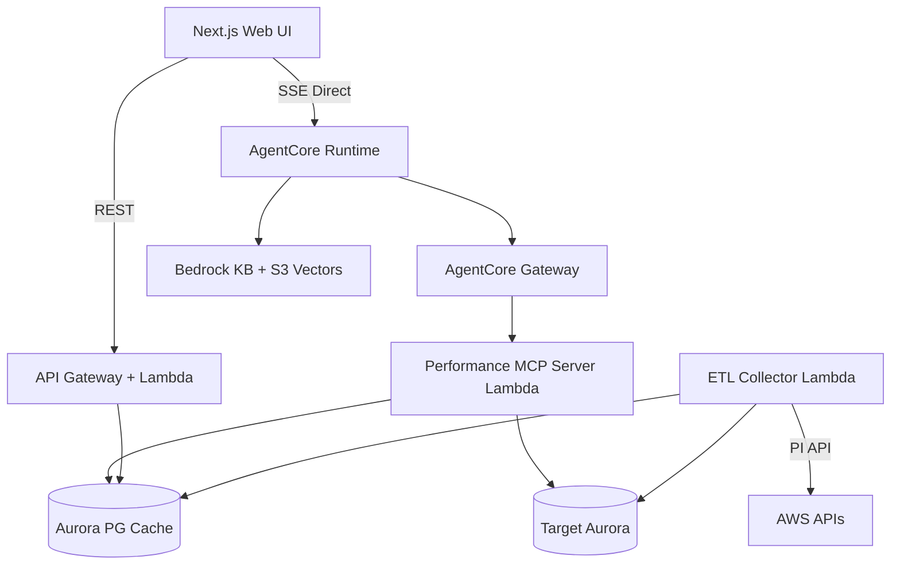
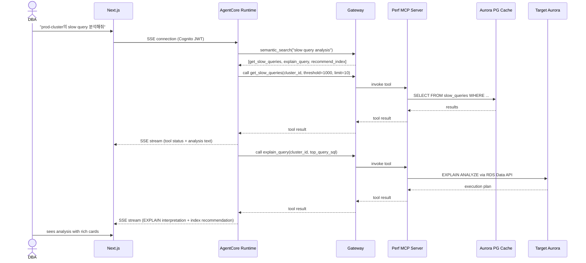

# Technical Design: Phase 1 — Performance Analysis Agent

## Overview
Single Strands Agent on AgentCore Runtime, connected to Performance MCP Server (6 tools) via AgentCore Gateway. Data collected by ETL Lambda into Aurora PG Cache. Next.js frontend with SSE direct connection for chat + REST API for dashboard.

## Architecture



## Components and Interfaces

### AgentCore Runtime
- Single Strands Agent with BedrockModel (Claude Sonnet)
- System prompt with Aurora cheatsheet (~2,000 tokens)
- Connected to Gateway via MCPClient + streamable_http
- Cognito JWT authentication for browser SSE
- AgentCore Memory for session persistence

### AgentCore Gateway
- One Lambda target: Performance MCP Server
- Semantic search enabled for tool discovery
- Cedar Policy: READ-ONLY (EXPLAIN/SELECT only)

### Performance MCP Server (Lambda)
Six tools, each a Python function:
- `get_top_queries(cluster_id, sort_by, limit)` → query Aurora PG Cache
- `explain_query(cluster_id, sql)` → EXPLAIN ANALYZE on target Aurora via RDS Data API
- `get_pi_metrics(cluster_id, metric_type, start_time, end_time)` → query Aurora PG Cache
- `recommend_index(cluster_id, query_hash)` → join index_usage + query_stats, compute recommendations
- `get_slow_queries(cluster_id, threshold_ms, limit)` → query Aurora PG Cache
- `compare_periods(cluster_id, period_a, period_b, metrics)` → two-period diff query

### Data Pipeline
- **ETL Collector Lambda**: triggered by EventBridge every 5 minutes
  - Calls PI GetResourceMetrics for AAS + wait events (1-min resolution)
  - Queries pg_stat_statements via RDS Data API
  - Stores results in Aurora PG Cache
- Tables: cluster_meta, metric_snapshots, query_stats, slow_queries, index_usage

### REST API (Lambda)
- `GET /api/dashboard/{cluster_id}` → aggregated metrics from Aurora PG Cache
- `GET /api/clusters` → list registered clusters
- `GET /api/metrics/{cluster_id}` → time-series data for charts

### Frontend (Next.js)
- `/chat` — SSE connection to AgentCore Runtime, message rendering with rich cards
- `/dashboard` — REST API polling via TanStack Query (5-second refresh)
- `/clusters` — cluster list and registration form
- Auth via Cognito Hosted UI, JWT stored in httpOnly cookie

## Data Models

### Aurora PG Cache Tables
```sql
CREATE TABLE cluster_meta (
    cluster_id VARCHAR(255) PRIMARY KEY,
    account_id VARCHAR(12) NOT NULL,
    region VARCHAR(20) NOT NULL,
    engine VARCHAR(20) NOT NULL,         -- aurora-mysql | aurora-postgresql
    engine_version VARCHAR(20),
    instance_class VARCHAR(50),
    status VARCHAR(20),
    endpoint TEXT,
    reader_endpoint TEXT,
    storage_size_gb DECIMAL(10,2),
    max_connections INT,
    spoke_role_arn TEXT,
    updated_at TIMESTAMPTZ DEFAULT NOW()
);

CREATE TABLE metric_snapshots (
    id BIGSERIAL,
    cluster_id VARCHAR(255) NOT NULL,
    timestamp TIMESTAMPTZ NOT NULL,
    metric_type VARCHAR(50) NOT NULL,     -- aas, cpu, connections, iops, etc.
    value DOUBLE PRECISION,
    dimensions JSONB,
    PRIMARY KEY (id, timestamp)
) PARTITION BY RANGE (timestamp);

CREATE TABLE query_stats (
    id BIGSERIAL,
    cluster_id VARCHAR(255) NOT NULL,
    snapshot_time TIMESTAMPTZ NOT NULL,
    query_hash VARCHAR(64) NOT NULL,
    query_text TEXT,
    calls BIGINT,
    total_time_ms DOUBLE PRECISION,
    mean_time_ms DOUBLE PRECISION,
    rows_returned BIGINT,
    shared_blks_hit BIGINT,
    shared_blks_read BIGINT,
    PRIMARY KEY (id, snapshot_time)
) PARTITION BY RANGE (snapshot_time);

CREATE TABLE slow_queries (
    id BIGSERIAL,
    cluster_id VARCHAR(255) NOT NULL,
    timestamp TIMESTAMPTZ NOT NULL,
    query_text TEXT,
    execution_time_ms DOUBLE PRECISION,
    lock_time_ms DOUBLE PRECISION,
    rows_examined BIGINT,
    rows_sent BIGINT,
    db_name VARCHAR(255),
    user_name VARCHAR(255),
    PRIMARY KEY (id, timestamp)
) PARTITION BY RANGE (timestamp);
```

Indexes: composite on `(cluster_id, timestamp)` for all time-series tables.

## Sequence Diagrams

### Chat Flow


## Error Handling
- RDS Data API timeout: retry once with exponential backoff, then return partial results with warning
- Aurora PG Cache connection failure: dashboard shows stale data banner with last-updated timestamp
- AgentCore Runtime SSE disconnect: frontend auto-reconnects, displays reconnecting indicator
- Tool execution failure: agent informs DBA of the specific failure and suggests alternative approach

## Testing Strategy
- **Unit**: Each MCP tool function tested with mocked DB responses
- **Integration**: MCP Server → Aurora PG Cache → verify query results
- **E2E**: Chat UI → AgentCore Runtime → Gateway → MCP → verify streamed response
- **CDK**: Snapshot tests for each stack
